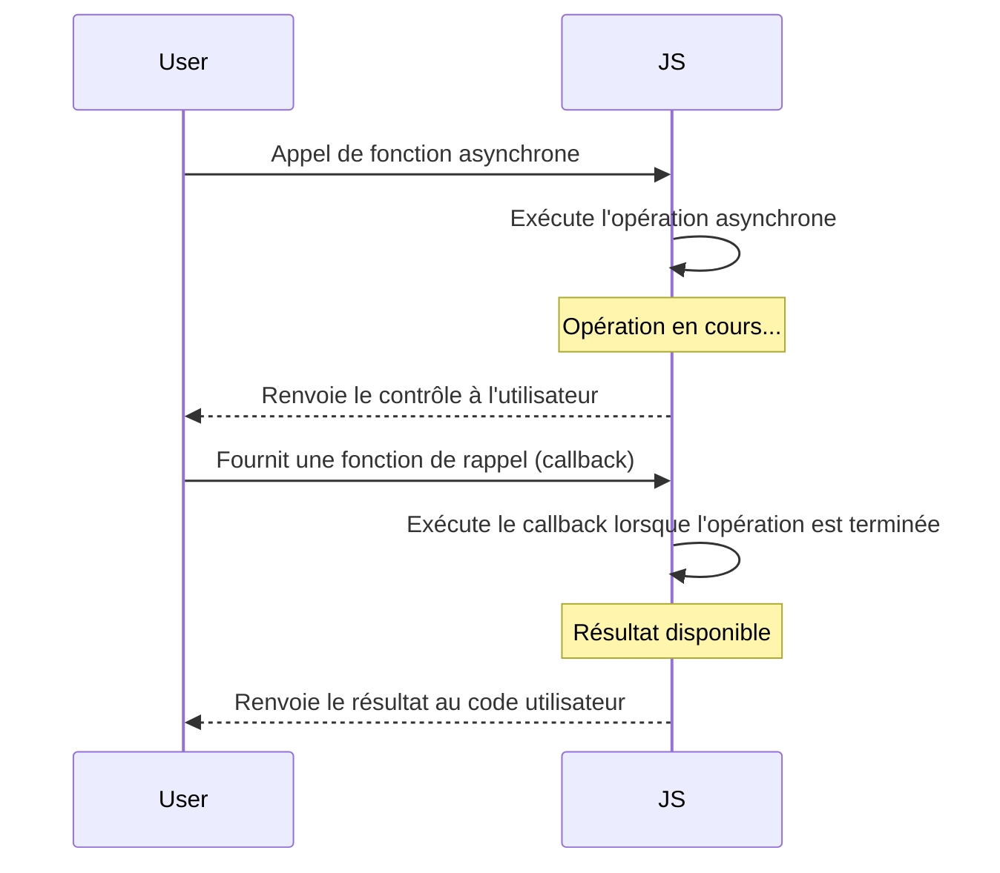

# Asynchrone

Ce schéma illustre comment une opération asynchrone en JavaScript fonctionne avec l'utilisation de callbacks pour gérer le résultat une fois que l'opération est terminée.



### 1. Introduction au JavaScript Asynchrone

En JavaScript, les opérations asynchrones sont des opérations qui permettent au code de continuer à s'exécuter pendant que ces opérations sont en cours, sans attendre leur achèvement. Cela est crucial dans le développement web pour améliorer l'expérience utilisateur, notamment lors de l'exécution de requêtes réseau, de la lecture de fichiers, ou d'autres opérations qui peuvent prendre du temps.

### Concepts Clés

- **Callback**: Une fonction passée en argument à une autre fonction qui sera exécutée une fois l'opération asynchrone terminée.
- **Promesses (Promises)**: Un objet représentant l'achèvement ou l'échec d'une opération asynchrone. Les promesses peuvent être chaînées pour une meilleure gestion des opérations asynchrones.
- **Async/Await**: Une syntaxe qui rend le travail avec des promesses plus confortable et plus lisible. `async` est utilisé pour déclarer une fonction asynchrone, et `await` est utilisé pour attendre la résolution d'une promesse à l'intérieur de cette fonction.

### 2. Exemples

#### Callbacks

```javascript
function fetchData(callback) {
  setTimeout(() => {
    callback("Données reçues");
  }, 1000);
}

fetchData((data) => {
  console.log(data); // Affiche "Données reçues" après 1 seconde
});
```

#### Promesses

```javascript
function fetchData() {
  return new Promise((resolve, reject) => {
    setTimeout(() => {
      resolve("Données reçues");
    }, 1000);
  });
}

fetchData().then(data => {
  console.log(data); // Affiche "Données reçues" après 1 seconde
});
```

#### Async/Await

```javascript
async function fetchAsyncData() {
  const data = await fetchData(); // fetchData retourne une promesse
  console.log(data); // Affiche "Données reçues" après que la promesse soit résolue
}

fetchAsyncData();
```

### 3. Exercices

#### Exercice 1: Utilisation de Callbacks
Ecrire une fonction `processData` qui prend un callback comme argument. Cette fonction doit utiliser `setTimeout` pour simuler une opération asynchrone qui prend 2 secondes, puis appelle le callback avec le résultat `"Données traitées"`.

#### Exercice 2: Conversion en Promesses
Convertir l'exercice précédent pour utiliser une promesse au lieu d'un callback.

#### Exercice 3: Utilisation d'Async/Await
Refaire l'exercice 2 en utilisant `async/await` pour gérer la promesse.

## Plan sur l'Asynchrone en JavaScript

### 1. Introduction au JavaScript Asynchrone
   - Définition des opérations asynchrones.
   - Importance dans le développement web.

### 2. Concepts Clés
   - **Callback**: Fonction passée en argument pour gérer le résultat d'une opération asynchrone.
   - **Promesses (Promises)**: Objet représentant l'achèvement ou l'échec d'une opération asynchrone.
   - **Async/Await**: Syntaxe facilitant le travail avec des promesses.

### 3. Exemples
   - **Callbacks**: Utilisation de callbacks pour gérer des opérations asynchrones.
   - **Promesses**: Création et utilisation de promesses.
   - **Async/Await**: Utilisation de la syntaxe `async/await` pour simplifier le code asynchrone.

### 4. Exercices
   - **Exercice 1: Utilisation de Callbacks**: Création d'une fonction `processData` avec callback.
   - **Exercice 2: Conversion en Promesses**: Transformation de l'exercice précédent en utilisant des promesses.
   - **Exercice 3: Utilisation d'Async/Await**: Refonte de l'exercice 2 en utilisant `async/await`.


## Exercice 4 simulation d'une API

:rocket: Les commentaires dans le code indiquent les parties que vous devez compléter.

- getAll
  
:rocket: **Étape 1**: Créez une fonction getAll qui retourne une promesse.
Utilisez setTimeout pour simuler un délai de chargement de 2 secondes.

```js

function getAll() {
  return new Promise((resolve, reject) => {
   // TODO
  });
}
```

- fetchData
  
:rocket: **Étape 2**: Créez une fonction fetchData qui utilise getAll.
Utilisez then et catch pour gérer le succès et l'erreur.

```js

function fetchData() {
  // TODO: Affichez un message "Début du chargement des données..."

  // TODO: Utilisez getAll() avec then pour gérer le succès
  // TODO: Utilisez catch pour gérer l'erreur
  // TODO: Utilisez finally pour afficher un message "Fin du chargement des données."
}
```

:rocket: **Étape 3**: Appelez la fonction fetchData pour tester votre implémentation.
Vérifiez la console pour voir les messages de début, de succès ou d'erreur, et de fin.

:rocket: **Etape 4:** Ajoutez une fonction displayData(data) qui affiche les données dans votre application.
Modifiez la fonction then de fetchData pour appeler displayData avec les données récupérées.

:rocket: **Etape 5:**  Ajoutez une gestion d'erreur spécifique dans catch pour traiter différentes erreurs.

:rocket: **Etape 6:** Ajoutez une interface utilisateur simple (peut être en HTML/CSS) pour afficher les données.


## Exercice 5 Travaux Pratiques Avancés

:rocket: **Objectif :** Ce TP vise à approfondir votre compréhension des promesses en JavaScript en simulant la gestion de tâches asynchrones. Vous utiliserez les concepts de base des promesses ainsi que `Promise.all` pour exécuter plusieurs tâches en parallèle.

**Étape 1 : Simulation de tâche asynchrone**

Créez une fonction asynchrone `simulateTask` qui simule une tâche asynchrone. Utilisez `setTimeout` pour simuler une durée variable entre 1 et 5 secondes. La fonction doit renvoyer une promesse qui se résout avec le nom de la tâche.

**Étape 2 : Exécution de plusieurs tâches en parallèle**

Créez une fonction asynchrone `runTasks` qui utilise `Promise.all` pour exécuter plusieurs tâches en parallèle. Les tâches à exécuter sont les suivantes : 'Tâche 1', 'Tâche 2', 'Tâche 3'. Affichez un message au début de l'exécution, puis utilisez `Promise.all` pour gérer les tâches en parallèle. Affichez les résultats si toutes les tâches se terminent avec succès, sinon, gérez l'erreur de manière appropriée. Enfin, affichez un message à la fin de l'exécution.

**Étape 3 : Testez votre implémentation**

Appelez la fonction `runTasks` pour tester votre implémentation. Vérifiez la console pour voir les messages de début, de succès ou d'erreur, et de fin.

**Étape 4 : fonction displayResults** 

- Ajoutez une fonction `displayResults(results)` qui affiche les résultats des tâches dans votre application. Modifiez la fonction `runTasks` pour appeler `displayResults` avec les résultats obtenus.

- Ajoutez une fonction asynchrone `handleError(error)` pour gérer les erreurs de manière spécifique. Modifiez la fonction `runTasks` pour appeler `handleError` en cas d'erreur.

- Utilisez `async/await` pour créer une séquence de tâches où la tâche suivante dépend du résultat de la précédente.

## Exercice 6 concat

Vous disposez d'un tableau de chaînes de caractères. 
Créez une fonction asynchrone qui prend le tableau ci-dessous en entrée et retourne la concaténation de ces chaînes dans l'ordre. Cependant, chaque concaténation doit être effectuée de manière asynchrone avec une pause de 1 seconde entre chaque concaténation. 

:pill: Utilisez des promesses pour gérer l'asynchrone.

- les données de départ.

```js
const words = ['Bonjour', ' ', 'le', ' ', 'monde']
```

### 5. Conclusion
   - Récapitulation des concepts clés de l'asynchrone en JavaScript.
   - Application des connaissances dans des scénarios pratiques.
   - Importance de choisir la méthode adaptée en fonction du contexte.